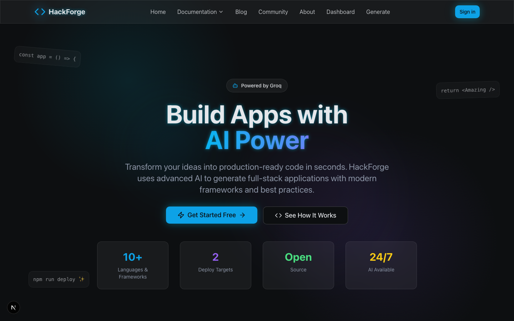
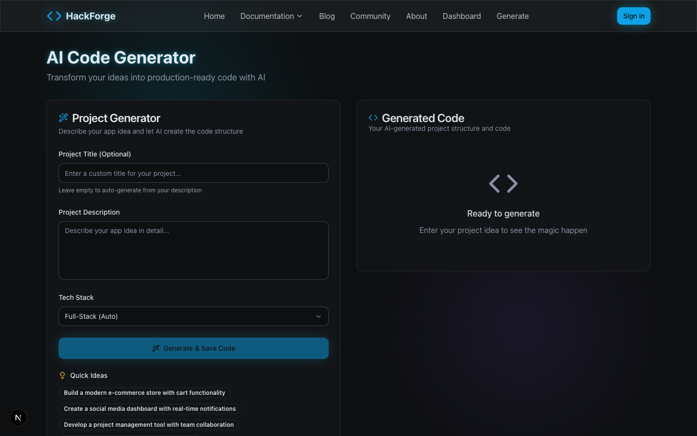
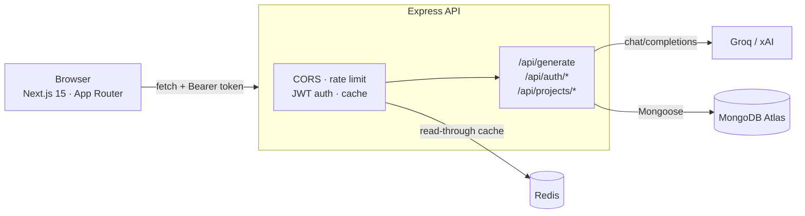

<div align="center">

# HackForge

**Turn a plain-English description into production-ready code.**

A full-stack AI code generation platform — Next.js 15 frontend, Express REST API,
MongoDB persistence, and Groq LLM inference — built to be deployed, not just demoed.

[](LICENSE)


[Live Demo](#) · [Deployment Guide](DEPLOYMENT.md) · [Report a Bug](https://github.com/yugankfatehpuria4/HackForge_2.0/issues)

<br />



<br /><br />



</div>

---

## Overview

HackForge takes a natural-language description of an application and returns a
structured, editable, downloadable codebase. Generation is open to anonymous
visitors; signing in adds a private project history with search, sorting, and
favorites.

The interesting part of this project isn't the LLM call — it's everything around
it: **auth that can't be spoofed, graceful degradation when infrastructure is
missing, and a deployment story that actually works on two different hosts.**

| | |
|---|---|
| **~7,750** lines across frontend and backend | **23** routes, 43 pages prerendered at build |
| **29** unit tests (Jest) | **0** TypeScript, ESLint, or build errors |

---

## Features

- **AI code generation** — describe an app, pick a stack, get working code. Powered by Groq's `llama-3.3-70b-versatile` (xAI Grok also supported).
- **In-browser editing** — generated files open in Monaco (the editor behind VS Code) with syntax highlighting, folding, and multi-file tabs.
- **Project dashboard** — search, sort, favorite, and delete saved generations.
- **JWT authentication** — email/password accounts; every project is scoped to its owner.
- **Export** — copy to clipboard, download a single file, or download the whole project as a ZIP.
- **Redis caching** — authenticated GET responses are cached per user for 60s.
- **Graceful degradation** — missing Mongo, Redis, or an AI key never crashes the server; each subsystem reports its own status and fails with an actionable message.

---

## Architecture



**Why two services?** The frontend is static-heavy and belongs on a CDN; the API
needs a long-lived process, a database connection, and an outbound AI call with
a multi-second tail. Splitting them lets each scale and deploy on its own.

### Request lifecycle for a generation

1. `POST /api/generate` hits a rate limiter (10 requests / 15 min).
2. `optionalAuth` decodes the bearer token if present — generation stays open to anonymous users.
3. The prompt is validated (non-empty, ≥10 chars) before any billable API call is made.
4. `aiService` posts to the provider's OpenAI-compatible `/chat/completions` endpoint.
5. On success, the result is saved to the caller's history **only if a verified `userId` exists**.
6. Upstream failures are mapped to actionable errors — a provider `401` becomes "check your key prefix", not a generic 500.

---

## Tech Stack

| Layer | Technology |
|---|---|
| **Frontend** | Next.js 15 (App Router), TypeScript (strict), Tailwind CSS, shadcn/ui, Radix UI, Framer Motion, Monaco Editor, Sonner |
| **Backend** | Node.js, Express 4, Mongoose 7, jsonwebtoken, bcryptjs, express-rate-limit, ioredis |
| **Data & AI** | MongoDB Atlas, Redis, Groq (`llama-3.3-70b-versatile`) / xAI Grok |
| **Tooling** | Jest, Testing Library, ESLint, TypeScript compiler |
| **Deployment** | Vercel (frontend), Render (API + Key Value cache) |

---

## Engineering Decisions

Notes on the non-obvious choices — the parts worth discussing in an interview.

**Identity comes from the token, never the request.**
Project routes originally read `userId` from `req.body` / `req.query`, so anyone
who guessed another user's id could read, edit, or delete their projects.
`requireAuth` now derives it from a verified JWT and the controllers refuse to
accept it from the request at all.

**Environment loading order is load-bearing.**
`aiService.js` reads `process.env` in its constructor and exports a ready-made
instance. `server.js` was requiring it *before* `dotenv.config()` ran, so the API
key was permanently unset and every generation failed with
"AI API key not configured" no matter what `backend/.env` contained. `dotenv` now
runs before any other require, with a comment explaining why nothing may move
above it.

**Cache keys are scoped to the caller.**
A read-through cache keyed on URL alone would serve one signed-in user's project
list to a different user requesting the same path. `optionalAuth` runs before the
cache middleware so the key can include the user id.

**Every dependency is optional except the AI key.**
Missing Mongo, Redis, or `JWT_SECRET` degrades to a documented fallback with a
startup warning rather than a crash — you can clone the repo and generate code
with nothing but a Groq key. Routes that genuinely need the database fail fast
with `503` instead of hanging for Mongoose's 10s buffering timeout.

**Timing-safe-ish auth responses.**
Login returns an identical error whether the email is unknown or the password is
wrong, so the endpoint can't be used to enumerate registered accounts.

**Search input is escaped before it reaches a regex.**
An unbalanced `(` typed into the dashboard search box used to reach
`new RegExp()` and throw a 500. Sort fields are validated against an allow-list
for the same reason.

---

## Getting Started

### Prerequisites

- Node.js 18.18+
- A Groq API key — [console.groq.com/keys](https://console.groq.com/keys) *(required)*
- MongoDB and Redis *(both optional — the app runs without them)*

### Install

```bash
git clone https://github.com/yugankfatehpuria4/HackForge_2.0.git
cd HackForge_2.0
npm install
npm run backend:install
```

### Configure

```bash
cp env.example .env.local
cp backend/env.example backend/.env
```

At minimum, set `GROQ_API_KEY` in `backend/.env`. To enable accounts and saved
projects, also set `MONGODB_URI` and `JWT_SECRET`:

```bash
node -e "console.log(require('crypto').randomBytes(48).toString('hex'))"
```

### Run

```bash
npm run backend:dev   # API   → http://localhost:5002
npm run dev           # Web   → http://localhost:3000
```

Confirm the backend wired up correctly — `services.ai` must be `true` before
generation works, `services.database` before accounts do:

```bash
curl http://localhost:5002/health
```

---

## Scripts

| Command | Description |
|---|---|
| `npm run dev` | Next.js dev server |
| `npm run build` | Production build (frontend only — the API deploys separately) |
| `npm start` | Serve the production build |
| `npm run typecheck` | TypeScript, no emit |
| `npm run lint` | ESLint |
| `npm test` | Jest unit tests |
| `npm run backend:dev` | API with nodemon |
| `npm run backend:start` | API, production mode |

---

## API Reference

Base URL: `http://localhost:5002`

| Method | Endpoint | Auth | Description |
|---|---|---|---|
| `GET` | `/health` | — | Service status for AI, cache, and database |
| `POST` | `/api/generate` | optional | Generate code; saves to history when signed in |
| `POST` | `/api/auth/register` | — | Create an account |
| `POST` | `/api/auth/login` | — | Exchange credentials for a 7-day token |
| `GET` | `/api/auth/me` | required | Current user |
| `GET` | `/api/projects` | required | List projects (search, sort, paginate) |
| `POST` | `/api/projects` | required | Create a project |
| `GET` | `/api/projects/:id` | required | Fetch one project |
| `PUT` | `/api/projects/:id` | required | Update a project |
| `DELETE` | `/api/projects/:id` | required | Delete a project |
| `PATCH` | `/api/projects/:id/favorite` | required | Toggle favorite |

```bash
# Generate without an account
curl -X POST http://localhost:5002/api/generate \
  -H 'Content-Type: application/json' \
  -d '{"prompt":"A React counter with increment and reset buttons."}'
```

---

## Project Structure

```
HackForge_2.0/
├── app/                    # Next.js App Router — pages, layouts, error boundaries
├── components/
│   ├── ui/                 # shadcn/ui primitives
│   └── *.tsx               # Feature components (prompt form, code output, header)
├── lib/                    # API base URL, auth client, content, utils
├── backend/
│   ├── controllers/        # Request handlers (auth, code, projects)
│   ├── middleware/         # JWT auth, error handler
│   ├── models/             # Mongoose schemas
│   ├── routes/             # Route definitions + rate limits
│   ├── services/           # AI provider client, Redis cache
│   ├── utils/              # JWT sign/verify
│   └── server.js           # App entry point
├── __tests__/              # Jest suites
├── render.yaml             # Render blueprint (frontend + API + cache)
└── vercel.json             # Vercel config + security headers
```

---

## Testing

```bash
npm test                # 29 tests across 4 suites
npm run test:coverage   # with coverage
```

Coverage focuses on the logic most likely to break silently: JWT signing and
verification, the auth middleware's accept/reject behavior, regex escaping and
sort-field validation in the project query layer, and API URL construction.

---

## Deployment

Frontend on Vercel, API on Render. See **[DEPLOYMENT.md](DEPLOYMENT.md)** for the
full walkthrough, including the two URL settings that cause most failed deploys.

```bash
# One-step: import render.yaml as a Render Blueprint,
# then import the repo at vercel.com/new
```

---

## Roadmap

- [x] JWT authentication with per-user project isolation
- [x] Multi-file editing with Monaco
- [x] ZIP export
- [x] Redis response caching
- [ ] Streaming token-by-token generation
- [ ] Push a generated project straight to a new GitHub repo
- [ ] One-click deploy of *generated* projects
- [ ] Usage analytics (tokens, latency, cost per generation)

---

## License

MIT — see [LICENSE](LICENSE).

## Author

**Yugank Fatehpuria**
[GitHub](https://github.com/yugankfatehpuria4)
